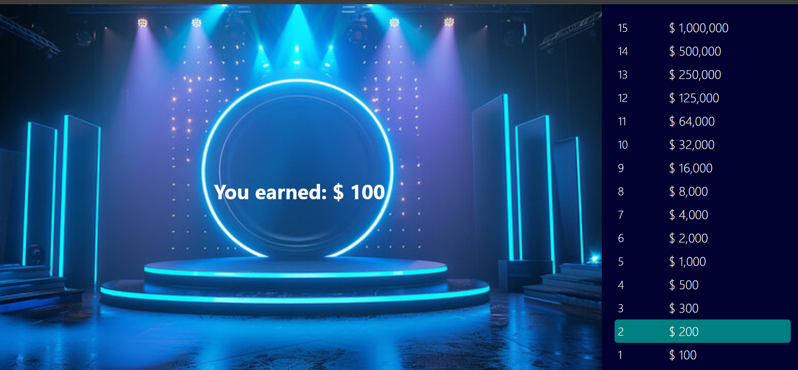

Here's a template for your `README.md` file for the project, including placeholders for the output screenshots:

```markdown
# Trivia Game Project

This is a trivia game built with React, where the user answers multiple-choice questions, and the game progresses with a timer. The project is structured using the MERN stack, and the game provides real-time feedback on correct and wrong answers.

## Features

- **Start Screen**: Begin the game with a "Start" button.
- **Timer**: A countdown timer is shown for each question.
- **Question Progression**: The questions progress after answering correctly.
- **Money Pyramid**: Displays the money the user has earned based on their progress in the game.
- **Result Screen**: Shows the user's total earnings at the end of the game.

## Usage

1. Open the app in your browser.
2. Click the **Start** button to begin the trivia game.
3. Answer the multiple-choice questions before time runs out.
4. The game ends when you either complete all questions or run out of time, showing your total earnings.

## Screenshots

### 1. Start Screen


### 2. Trivia Game with Timer


### 3. End Screen with Results


## Technologies Used

- **React**: For building the user interface.
- **CSS**: For styling the application.
- **JavaScript**: For game logic and interactivity.

